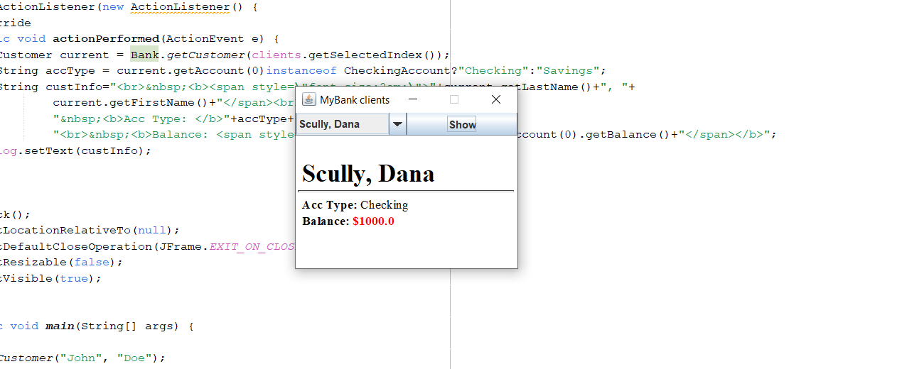
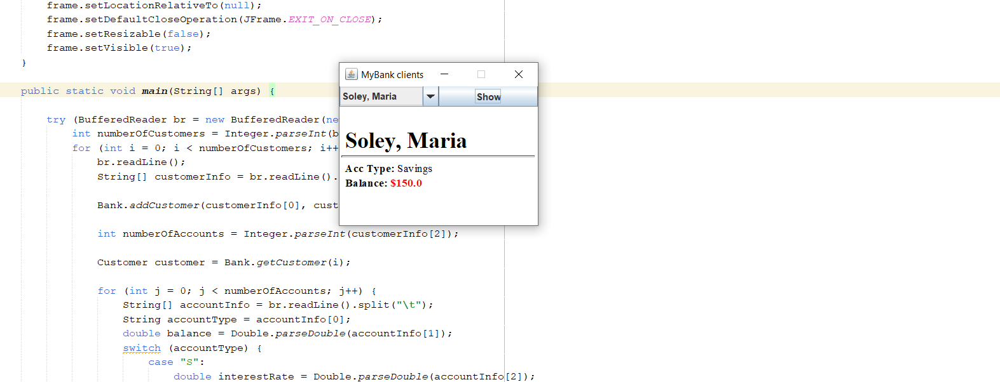
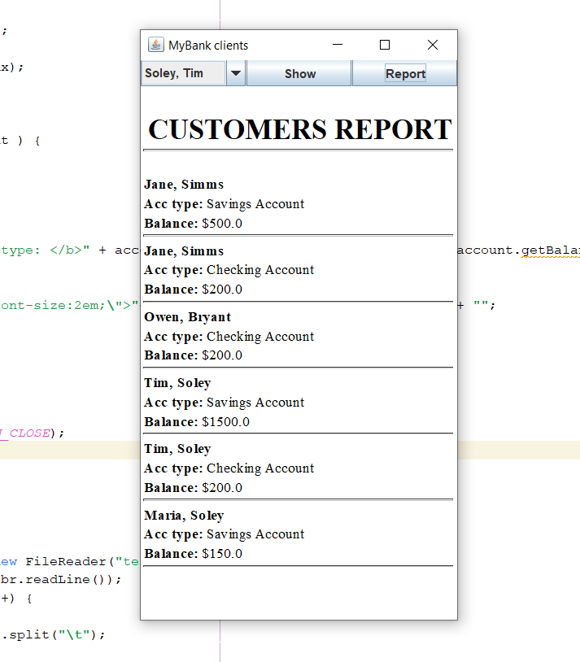

[](https://classroom.github.com/open-in-codespaces?assignment_repo_id=15229090)
# UI Lab 3


## Завдання на 3



## Завдання на 4

Додала код для читання з минулих ПР



## Завдання на 5



```java
  report.addActionListener(new ActionListener(){
            @Override
            public void actionPerformed(ActionEvent e){
               
                String title = "CUSTOMERS REPORT";
                String customers = "";
                String customerName = "";
                String account_type = "";          
    
    for ( int cust_idx = 0;
          cust_idx < Bank.getNumberOfCustomers();
          cust_idx++ ) {
      Customer customer = Bank.getCustomer(cust_idx);
      customerName = customer.getFirstName() + ", " + customer.getLastName();
     
      for ( int acct_idx = 0;
            acct_idx < customer.getNumberOfAccounts();
            acct_idx++ ) {
        Account account = customer.getAccount(acct_idx);
        
        if ( account instanceof SavingsAccount ) {
          account_type = "Savings Account";
        } else if ( account instanceof CheckingAccount ) {
          account_type = "Checking Account";
        } else {
          account_type = "Unknown Account Type";
        }

        customers += "<b>" + customerName + "<br>Acc type: </b>" + account_type + "<br><b>Balance: </b> $" + account.getBalance() + "<br><hr>";
      }
    }
        String report = "<br>&nbsp;<b><span style=\"font-size:2em;\">"+title+"</span><br><hr><br>" +customers+ "";
        log.setText(report);  
            }
        });
        
        frame.pack();
        frame.setLocationRelativeTo(null);
        frame.setDefaultCloseOperation(JFrame.EXIT_ON_CLOSE);  
        frame.setResizable(true);
        frame.setVisible(true);        
    }
```

---
**УВАГА! Не забуваємо здавати завдання через Google Classroom та вказувати посилання на створений для вас репозиторій!**

Також пам'ятайте, що ніхто не заважає вам редагувати файл README у вашому репозиторії😉.
А ще - дуже раджу спробувати нову фічу - інтеграцію з IDE REPL.it (хоч з таким завданням вона може й не впоратись, однак, цікаво ж!).

[](https://gitter.im/PPC-SE-2020/OOP?utm_source=badge&utm_medium=badge&utm_campaign=pr-badge)


 
